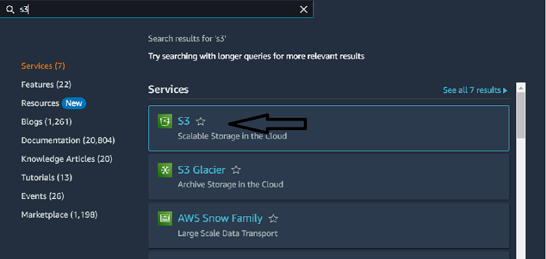
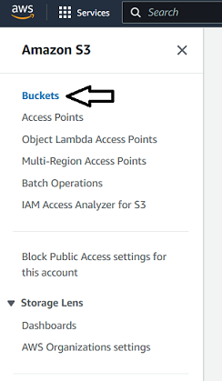
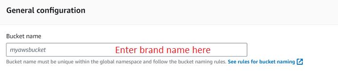
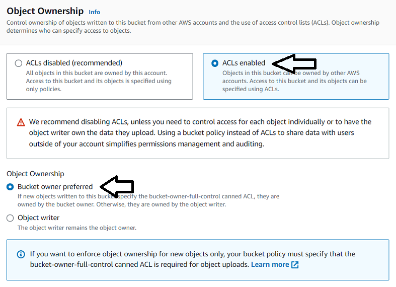
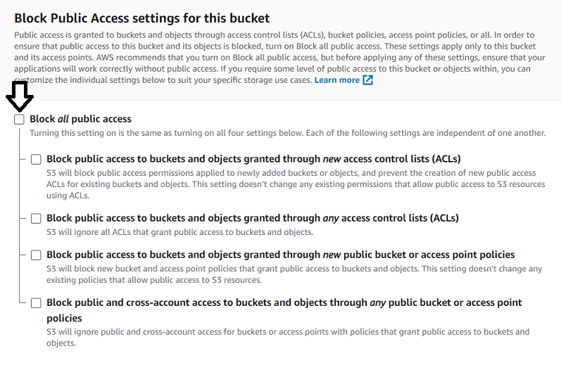
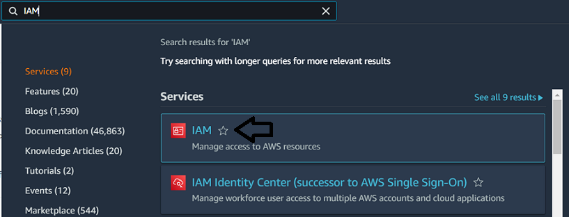
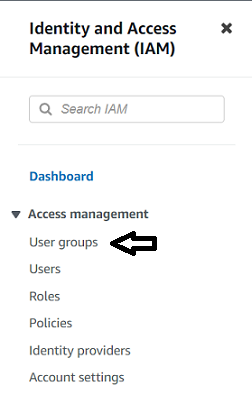
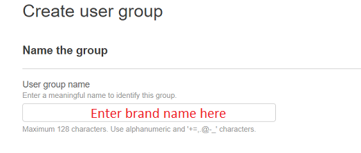
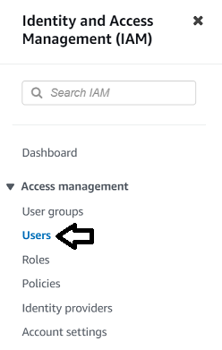
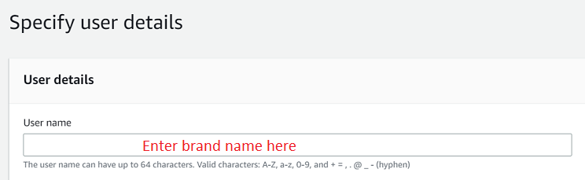

<h1 align="center" style="display: block; font-size: 2.5em; font-weight: bold; margin-block-start: 1em; margin-block-end: 1em;">
  <br /><br /><strong>BACKEND CORE</strong>
</h1>

# Introduction[](#introduction)

Backend project for linco care brands.

---

# Table of Contents

- [Introduction](#introduction)
- [Table of Contents](#table-of-contents)
- [Prerequisites](#prerequisites)
- [Settings](#settings)
  - [Security and Debug](#security-and-debug)
  - [Host and Website](#host-and-website)
  - [Database](#database)
  - [Email Service](#email-service)
  - [Redis and Celery](#redis-and-celery)
  - [Shopify](#shopify)
  - [Mailjet](#mailjet)
  - [File or Directory Locations](#file-or-directory-locations)
  - [Google reCAPTCHA](#google-recaptcha)
  - [Veeqo](#veeqo)
  - [Cookie Keys](#cookie-keys)
  - [AWS (optional)](#aws-optional)
    - [Setup](#setup)
    - [Environment Variables](#environment-variables)
  - [Instagram (optional)](#instagram-optional)
  - [IP Info (optional)](#ip-info-optional)
- [Deployment](#deployment)
  - [Clone the Project](#clone-the-project)
  - [Set Environment Variables](#set-environment-variables)
  - [Setup Postgres](#setup-postgres)
  - [Build All the Containers](#build-all-the-containers)
  - [Apply Migrations](#apply-migrations)
  - [Collect Statics](#collect-statics)
  - [Cloudflare](#cloudflare)
  - [Nginx](#nginx)
- [Configuration Model](#configuration-model)

---

# Prerequisites

Before deploying the project you have to make sure that you have the following pre-requisites installed:

- Nginx
- Docker
- Docker Compose
- Git

---

# Settings[](#settings)

There are some configurations needed before starting the deployment. Most of the
configurations are saved as environment variables. To add an environment variable, you must
create a `.env` file beside the docker-compose file of the project and add the variables in that file.

## Security and Debug

- `SECRET_KEY`
  - A long random string as the secret key of the project.
- `DEBUG`
  - If `True` the project will run in debug mode.
- `PRODUCTION_ENVIRONMENT`
  - If `True` the settings in `production.py` will be imported.
  - If `False` the settings in `development.py` will be imported.

## Host and Website

- `BRAND_NAME`
  - Name of the brand.
  - It should start with a capital letter.
- `BACKEND_ADDRESS`
  - Backend url. eg: `https://api.mydomain.com`
- `WEBSITE_ADDRESS`
  - Frontend url. eg: `https://mydomain.com`
- `ALLOWED_HOSTS`
  - Sets the `ALLOWED_HOSTS` setting in django.
  - Should at least contain `.mydomain.com`.
  - Can add more domains if needed.
- `CSRF_COOKIE_DOMAIN`
  - Sets the `CSRF_COOKIE_DOMAIN` setting in django.
  - Should be `.mydomain.com`.

## Database

To connect your django project to your database, you should set
the following environment variables:

- `DB_ENGINE`
  - Database engine. eg: `django.db.backends.postgresql` for a PostgreSQL database.
- `DB_NAME`
  - Name of the database you want your project to connect to.
- `DB_USER`
  - Name of the user you want to connect to database with.
- `DB_PASSWORD`
  - Password of the user `DB_USER`.
- `DB_HOST`
  - The host to use when connection to the database.
- `DB_PORT`
  - The port to use when connection to the database.
- `DB_OPTIONS`
  - Extra parameters to use when connection to the database.

## Email Service

You have to set up an email service for your brand and afterward, set the
following environment variables:

- `EMAIL_HOST`
  - The host to use for sending email.
- `EMAIL_HOST_USER`
  - Username to use for the SMTP server.
- `EMAIL_HOST_PASSWORD`
  - Password to use for the SMTP server.
- `EMAIL_PORT`
  - Port to use for the SMTP server.
- `DEFAULT_FROM_EMAIL`
  - Default email address for emails through django.
  - Emails will be sent from this address.
- `EMAIL_SUBJECT_PREFIX`
  - Email subject prefix for emails sent to admins and managers through django.
- `DJANGO_ADMINS`
  - Name and email address of the django project admins.
  - Must have the following pattern: \<name>:\<address>,\<name2>:\<address2>...
  - Admins receive code error emails.
- `DEFAULT_CUSTOMER_SERVICE_EMAIL`
  - Email address of your customer service.
- `DEFAULT_MARKETING_EMAIL`
  - Email address of your marketing team.
- `VALID_STAFF_EMAIL_DOMAINS`
  - Valid email domains for the staff of your brand.
  - In some APIs, if the given email is not in one of the given domains, the API will fail.
  - Domains should be comma separated.
- `DOMAIN`
  - This field is only used in some automatic django emails.
  - It's only the domain of the frontend website. eg: `mydomain.com`
- `SITE_NAME`
  - This field is only used in some automatic django emails.
  - It should be the brand name.

## Redis and Celery

- `REDIS_HOST`
  - The host to use when connecting to Redis.
- `RABBITMQ_HOST`
  - The host to use when connecting to RabbitMQ.

## Shopify

To connect to the Shopify account related to the brand, you should set the following
environment variables:

- `SHOPIFY_SHARED_SECRET_KEY`
  - Can be found in the Shopify admin
- `SHOPIFY_PASSWORD`
  - Can be found in the Shopify admin
- `SHOPIFY_API_VERSION`
  - The version of the admin API. eg: 2023-07
  - It should usually be one of the two latest versions.
- `SHOPIFY_DOMAIN`
  - Shop domain in Shopify. eg: store-name.myshopify.com

## Mailjet

This project uses Mailjet for transactional emails. After creating an account
for your brand on Mailjet, set the following environment variables:

- `MAILJET_API_KEY`
  - Mailjet API key.
  - Found in mailjet admin.
- `MAILJET_SECRET_KEY`
  - Mailjet secret key.
  - Found in mailjet admin.

## File or Directory Locations

Some settings are related to the location of some file or directories
which are as following:

- `LOST_PRODUCT_IMAGE_PATH`
  - If a product doesn't have a product image, this image will be used.
  - It should be manually uploaded somewhere inside the media directory.
  - If media files are being served locally and
    its path is `media/foo/bar.jpg`, this variable
    should be set to `/media/foo/bar.jpg`.
  - If media files are being served by AWS, this variable should be
    the complete url of the image.
- `INSTAGRAM_IMAGES_PATH`
  - This is the directory containing all the instagram images.
  - It should be manually uploaded somewhere inside the media directory.
  - If its path is `media/foo`, this variable should be set to `/media/foo`.
- `BRAND_DIR_NAME`
  - This field is used in the docker-compose file to name directories related
    to your project.
  - It should be the brand name but lowercase.

## Google reCAPTCHA

First set up a Google reCAPTCHA v2, afterward, set the following environment
variables:

- `DRF_RECAPTCHA_SECRET_KEY`
  - Found in google admin.
- `DRF_RECAPTCHA_PROXY`
  - Found in google admin.

## Veeqo

We need the below Veeqo environment variables:

- `VEEQO_API_URL`
  - https://api.veeqo.com
- `VEEQO_API_KEY`
  - Found in Veeqo under user settings

## Cookie Keys

This projects uses cookies in some of its procedures. The following
environment variables are the cookie keys:

- `REVIEW_RATE_COOKIE_KEY`
  - In the process of liking and disliking a review, we set a cookie to stop
    (to some extent)
    anonymous users from spamming like or dislike.
  - By default, it's set to `review-rate`.

## AWS (optional)

If you want to use AWS for the project's static and media files, take the
following steps:

### Setup

Login to your AWS account and follow these steps to set up your bucket.

<details>
<summary>Create a bucket</summary>
On the search bar type "s3" and choose the S3 option as shown below:



Afterward, select "buckets" from the left menu:



Now click on the "Create bucket" button. On this page set the following settings:

- Set the bucket name to something unique containing your brand name.



- Enable ACLs and set the object ownership to "Bucket owner preferred".



- Uncheck the "Block all public access" and all other checkboxes on that section.



- Don't change other settings and create the bucket.
</details>

<details>
<summary>Add bucket permissions</summary>
After creating the bucket, you will be redirected to the list of buckets.
Click on your bucket and select the "Permissions" tab in your bucket's page.
Make the following changes:

- Add the JSON object below to the "Bucket Policy" section.
  This will fully public all the files in the bucket. Note that you
  should replace "$BUCKET_NAME" with the project's bucket name.

```json
{
  "Version": "2012-10-17",
  "Statement": [
    {
      "Sid": "allowPerm",
      "Effect": "Allow",
      "Principal": "*",
      "Action": "s3:GetObject",
      "Resource": "arn:aws:s3:::$BUCKET_NAME/*"
    }
  ]
}
```

- Add the JSON object below to the CORS section.
  This will prevent later CORS errors.

<div style="height: 400px; overflow: auto;">

```json
[
  {
    "AllowedHeaders": ["Authorization"],
    "AllowedMethods": ["GET"],
    "AllowedOrigins": ["*"],
    "ExposeHeaders": [],
    "MaxAgeSeconds": 3000
  },
  {
    "AllowedHeaders": ["*"],
    "AllowedMethods": ["HEAD", "GET", "PUT", "POST", "DELETE"],
    "AllowedOrigins": ["*"],
    "ExposeHeaders": ["ETag", "x-amz-meta-custom-header"]
  }
]
```

</div>
</details>

<details>
<summary>Create a user group</summary>
On the search bar type "IAM" and choose the IAM option as shown below:



Afterward, select "User Groups" from the left menu:



Now click on the "Create Group" button. On this page, set the following settings:

- Set the group name to your brand name.



- On the "Attach permissions policies" section, click on "Create policy".
  Copy the JSON object below to the policy editor, and name the policy
  "<BRAND>S3FullAccess".

```json
{
  "Version": "2012-10-17",
  "Statement": [
    {
      "Effect": "Allow",
      "Action": "s3:*",
      "Resource": ["arn:aws:s3:::$BRAND_NAME", "arn:aws:s3:::$BRAND_NAME/*"]
    }
  ]
}
```

- Go back to the group create page and refresh the policies list.
  Choose the policy you just created.
- Create the group.
</details>

<details>
<summary>Create a user</summary>
Go back to IAM dashboard and this time select "Users" from the left menu:



Now click on the "Add users" button. On this page, set the following settings:

- Set the username to <BRAND>-admin and click next.



- Choose the user group you created.
- Create the user.
</details>

<details>
<summary>Create access key</summary>
To be able to use AWS APIs, you need to create access keys for the user
just created. To create the access keys, take the following steps:

- Go to the users page and select the user you just created.
- Select the "Security credentials" tab.
- Scroll down to "Access keys" section and click on "Create access key" button.
- You will see a list of use-cases to choose from. For this project the use case
  is "Application running outside AWS".
- It's optional to add a description.
- Create access key.
- On the next page, it will show you an access key and a secret access key.
  You will only see the secret access key once, so be sure to never lose it.

</details>

### Environment Variables

After retrieving AWS API keys, to connect your project to AWS,
you must set the following environment variables:

- `USE_S3`
  - Set to `True` for your project to use AWS for static and media files.
  - By default, it is set to `False`
- `AWS_ACCESS_KEY_ID`
  - AWS access key retrieved after setting up our bucket.
- `AWS_SECRET_ACCESS_KEY`
  - AWS secret access key retrieved after setting up our bucket.
- `AWS_STORAGE_BUCKET_NAME`
  - Bucket name used for this project.

## Instagram (optional)

If your brand has an Instagram account, and you want to show its timeline in
your website, you should set the following environment variables:

- `INSTAGRAM_USER_ID`
  - Numeric unique identifier for your brand's Instagram account.

## IP Info (optional)

If you want to get the location info of certain IPs, to integrate your
project with [ipinfo.io](https://ipinfo.io), after creating an account,
set the following environment variable:

- `IP_INFO_TOKEN`
  - Found in ipinfo admin.

---

# Deployment

### Clone the Project

Clone the project and cd into the project directory.

```shell
git clone git@github.com:danialbagheri/Core-API.git
cd Core-API/
```

### Set Environment Variables

Add the `.env` file created in the [settings](#settings) section to this directory.
<br>
Also add a `.env.postgres` file with only one field, `POSTGRES_PASSWORD`,
which is the password for the user `postgres`.

### Setup Postgres

First create the postgres container. You should use `docker-compse.staging.yml`
if you are setting up the staging server.

<details>
<summary>Main server</summary>

```shell
docker-compose build postgres && docker-compose up -d postgres
```

</details>

<details>
<summary>Staging server</summary>

```shell
docker-compose -f docker-compose.staging.yml build postgres && docker-compose -f docker-compose.staging.yml up -d postgres
```

</details>

Next connect to the postgres container bash. You can check the container
name by using `docker ps`.

```shell
docker exec -it <CONTAINER_NAME> bash
```

Create the postgres user for your project.

```shell
createuser -U postgres --interactive -P
```

Enter the username, password and set the user to superuser. For now, we work with a superuser,
on the later versions of this readme file, other approaches should be added for more security.
<br>
Now create the database.

```shell
createdb -U postgres <DB_NAME>
```

### Build All the Containers

Now that we created the user and the database of the project, we can build all the containers.
Similar to before, we will use `docker-compose.staging.yml` for our staging server.

<details>
<summary>Main server</summary>

```shell
docker-compose build && docker-compose up -d
```

</details>

<details>
<summary>Staging server</summary>

```shell
docker-compose -f docker-compose.staging.yml build && docker-compose -f docker-compose.staging.yml up -d
```

</details>

### Apply Migrations

To apply project migrations, we must connect to the api container shell.

```shell
docker exec -it <CONTAINER_NAME> sh
```

And then use the `migrate` command.

```shell
python manage.py migrate
```

### Collect Statics

For your django admin to work properly, you need to collect static files used in the admin
in a certain location. The `collectstatic` command does this for you. You
must also enter this command in the api container shell.

```shell
python manage.py collectstatic
```

Note: If you are using AWS for your static files, this might take a very long time, so you also
can consider manually uploading your static files in the `static` directory in your bucket.

### Cloudflare

The only step left to deploy the project, is to connect it to Nginx.
We want our requests to be secure (use https), to handle this, we use Cloudflare.
So before setting up our Nginx, we have to set up our Cloudflare settings.
Take the following steps to set up your Cloudflare account.

- Register your site.
- Go to the "DNS" tab in the left menu and add a record for your domain.
  - The type of the record should be A.
- Go to the "Overview" section of "SSL/TLS" tab in the left menu
  and select the "Full (strict)" mode.
- Go to the "Origin Server" section of "SSL/TLS" tab.
- Create a certificate. NOTE: Only create it for the exact hosts you are using.
  Using for all the subdomains might break another website.
  - Save the "Origin Certificate" at `/etc/ssl/<brand>-cert.pem`.
  - Save the "Private key" at `/etc/ssl/<brand>-key.pem`.
- Add the Cloudflare certificate below to `/etc/ssl/cloudflare.crt`.
  - This will set up authenticated origin pulls.

```
-----BEGIN CERTIFICATE-----
MIIGCjCCA/KgAwIBAgIIV5G6lVbCLmEwDQYJKoZIhvcNAQENBQAwgZAxCzAJBgNV
BAYTAlVTMRkwFwYDVQQKExBDbG91ZEZsYXJlLCBJbmMuMRQwEgYDVQQLEwtPcmln
aW4gUHVsbDEWMBQGA1UEBxMNU2FuIEZyYW5jaXNjbzETMBEGA1UECBMKQ2FsaWZv
cm5pYTEjMCEGA1UEAxMab3JpZ2luLXB1bGwuY2xvdWRmbGFyZS5uZXQwHhcNMTkx
MDEwMTg0NTAwWhcNMjkxMTAxMTcwMDAwWjCBkDELMAkGA1UEBhMCVVMxGTAXBgNV
BAoTEENsb3VkRmxhcmUsIEluYy4xFDASBgNVBAsTC09yaWdpbiBQdWxsMRYwFAYD
VQQHEw1TYW4gRnJhbmNpc2NvMRMwEQYDVQQIEwpDYWxpZm9ybmlhMSMwIQYDVQQD
ExpvcmlnaW4tcHVsbC5jbG91ZGZsYXJlLm5ldDCCAiIwDQYJKoZIhvcNAQEBBQAD
ggIPADCCAgoCggIBAN2y2zojYfl0bKfhp0AJBFeV+jQqbCw3sHmvEPwLmqDLqynI
42tZXR5y914ZB9ZrwbL/K5O46exd/LujJnV2b3dzcx5rtiQzso0xzljqbnbQT20e
ihx/WrF4OkZKydZzsdaJsWAPuplDH5P7J82q3re88jQdgE5hqjqFZ3clCG7lxoBw
hLaazm3NJJlUfzdk97ouRvnFGAuXd5cQVx8jYOOeU60sWqmMe4QHdOvpqB91bJoY
QSKVFjUgHeTpN8tNpKJfb9LIn3pun3bC9NKNHtRKMNX3Kl/sAPq7q/AlndvA2Kw3
Dkum2mHQUGdzVHqcOgea9BGjLK2h7SuX93zTWL02u799dr6Xkrad/WShHchfjjRn
aL35niJUDr02YJtPgxWObsrfOU63B8juLUphW/4BOjjJyAG5l9j1//aUGEi/sEe5
lqVv0P78QrxoxR+MMXiJwQab5FB8TG/ac6mRHgF9CmkX90uaRh+OC07XjTdfSKGR
PpM9hB2ZhLol/nf8qmoLdoD5HvODZuKu2+muKeVHXgw2/A6wM7OwrinxZiyBk5Hh
CvaADH7PZpU6z/zv5NU5HSvXiKtCzFuDu4/Zfi34RfHXeCUfHAb4KfNRXJwMsxUa
+4ZpSAX2G6RnGU5meuXpU5/V+DQJp/e69XyyY6RXDoMywaEFlIlXBqjRRA2pAgMB
AAGjZjBkMA4GA1UdDwEB/wQEAwIBBjASBgNVHRMBAf8ECDAGAQH/AgECMB0GA1Ud
DgQWBBRDWUsraYuA4REzalfNVzjann3F6zAfBgNVHSMEGDAWgBRDWUsraYuA4REz
alfNVzjann3F6zANBgkqhkiG9w0BAQ0FAAOCAgEAkQ+T9nqcSlAuW/90DeYmQOW1
QhqOor5psBEGvxbNGV2hdLJY8h6QUq48BCevcMChg/L1CkznBNI40i3/6heDn3IS
zVEwXKf34pPFCACWVMZxbQjkNRTiH8iRur9EsaNQ5oXCPJkhwg2+IFyoPAAYURoX
VcI9SCDUa45clmYHJ/XYwV1icGVI8/9b2JUqklnOTa5tugwIUi5sTfipNcJXHhgz
6BKYDl0/UP0lLKbsUETXeTGDiDpxZYIgbcFrRDDkHC6BSvdWVEiH5b9mH2BON60z
0O0j8EEKTwi9jnafVtZQXP/D8yoVowdFDjXcKkOPF/1gIh9qrFR6GdoPVgB3SkLc
5ulBqZaCHm563jsvWb/kXJnlFxW+1bsO9BDD6DweBcGdNurgmH625wBXksSdD7y/
fakk8DagjbjKShYlPEFOAqEcliwjF45eabL0t27MJV61O/jHzHL3dknXeE4BDa2j
bA+JbyJeUMtU7KMsxvx82RmhqBEJJDBCJ3scVptvhDMRrtqDBW5JShxoAOcpFQGm
iYWicn46nPDjgTU0bX1ZPpTpryXbvciVL5RkVBuyX2ntcOLDPlZWgxZCBp96x07F
AnOzKgZk4RzZPNAxCXERVxajn/FLcOhglVAKo5H0ac+AitlQ0ip55D2/mf8o72tM
fVQ6VpyjEXdiIXWUq/o=
-----END CERTIFICATE-----
```

### Nginx

At this moment, all of your containers are up and running, and
the connection between your server and Cloudflare is configured.
all you need to do is to set up your Nginx. Take the following steps
to set up your nginx:

- Get the api container ip address with the following command:

```shell
docker inspect <API_CONTAINER_ID> | grep IPAddress
```

- Add the config file below to `/etc/nginx/available-sites/`.
  - The file should be named after the project's url, eg: `api.cabanasun.co.uk`.
  - Config differs depending on the approach chosen for serving static files.
  - Use the ip retrieved in the previous step as `API_CONTAINER_IP`

<details>
<summary>Local static and media files</summary>

```
server {
    listen 80;
    listen [::]:80;
    server_name <ENTER_URL_HERE>;
    return 302 https://$server_name$request_uri;
}

server {
    listen 443 ssl http2;
    listen [::]:443 ssl http2;
    ssl_certificate         /etc/ssl/<BRAND_NAME>-cert.pem;
    ssl_certificate_key     /etc/ssl/<BRAND_NAME>-key.pem;
    ssl_client_certificate /etc/ssl/cloudflare.crt;
    ssl_verify_client on;

    error_log /var/log/nginx/<ENTER_LOG_FILE_NAME_HERE>.log;
    server_name <ENTER_URL_HERE>;

    location = /favicon.ico { access_log off; log_not_found off; }

    location /static/admin/fonts/ {
        add_header Access-Control-Allow-Origin *;
        alias /var/volumes/<BRAND_NAME>/static/admin/fonts/;
    }

    location /static/summernote/font/ {
        add_header Access-Control-Allow-Origin *;
        alias /var/volumes/<BRAND_NAME>/static/summernote/font/;
    }

    location /static/ {
        alias /var/volumes/<BRAND_NAME>/static/;
    }

    location /media/ {
        alias /var/volumes/<BRAND_NAME>/media;
    }

    location / {
        include proxy_params;
        proxy_pass http://<API_CONTAINER_IP>:8000;
    }
}
```

</details>

<details>
<summary>S3 static and media files</summary>

```
server {
    listen 80;
    listen [::]:80;
    server_name <ENTER_URL_HERE>;
    return 302 https://$server_name$request_uri;
}

server {
    listen 443 ssl http2;
    listen [::]:443 ssl http2;
    ssl_certificate         /etc/ssl/<BRAND_NAME>-cert.pem;
    ssl_certificate_key     /etc/ssl/<BRAND_NAME>-key.pem;
    ssl_client_certificate /etc/ssl/cloudflare.crt;
    ssl_verify_client on;

    error_log /var/log/nginx/<ENTER_LOG_FILE_NAME_HERE>.log;
    server_name <ENTER_URL_HERE>;

    set $bucket "<BUCKET_NAME>.s3.amazonaws.com";

    location = /favicon.ico { access_log off; log_not_found off; }

    location /static/ {
        resolver 8.8.8.8;
        proxy_set_header Host $bucket;
        proxy_pass https://$bucket;
    }

    location /media/ {
        resolver 8.8.8.8;
        proxy_set_header Host $bucket;
        proxy_pass https://$bucket;
    }

    location / {
        include proxy_params;
        proxy_pass http://<API_CONTAINER_IP>:8000;
    }
}
```

</details>

- If you are hosting more than one website, add
  this line to the `http` bracket of `/etc/nginx/nginx.conf`:

```
server_names_hash_bucket_size 64;
```

- Check validity of your nginx configurations with:

```shell
sudo nginx -t
```

- If everything is ok, start nginx:

```shell
sudo systemctl reload nginx
```

This is it! You have successfully deployed your project ^\_^

---

# Configuration Model

After deploying your project, for your project to work properly, you must set some more configurations.
There is a model named `Configuration`. It has two main fields, `key`, and `value`. You should
set the following keys through your django admin:

- `admin-emails`
  - Emails related to project admins will be sent to these emails.
  - Comma separated.
- `manager-emails`
  - Emails related to project managers will be sent to these emails.
  - Comma separated.
- `customer_service_emails`
  - Emails related to customer service will be sent to these emails.
- `marketing_emails`
  - Emails related to the marketing team will be sent to these emails.
- `review-approval-email-template-id`
  - Mailjet template id for the review approval email.
- `in-stock-email-template-id`
  - Mailjet template id for the in-stock email.
- `review-reminder-email-template-id`
  - Mailjet template id for the review reminder email.
- `instagram_access_token`
  - Current Instagram access token.
- `instagram_access_token_timestamp`
  - Time that Instagram access token was refreshed.

---

DISCLAIMER: All rights of this project are reserved for Linco Care limited.
